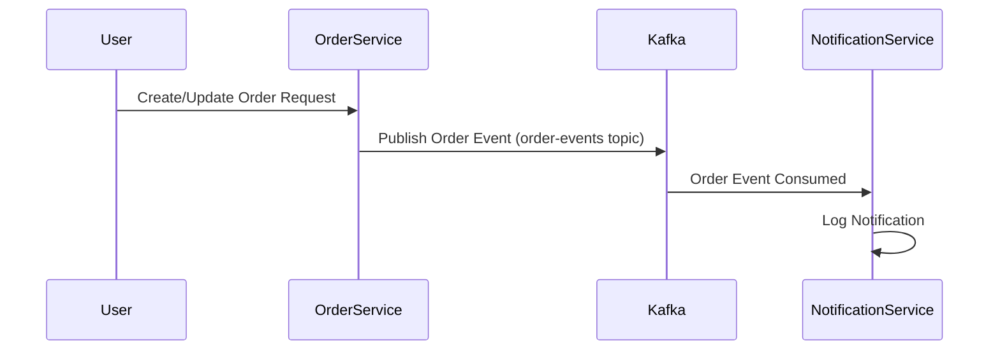

# Kafka Order Notification Microservices Example

This repository demonstrates a microservices architecture using **Spring Boot**, **Apache Kafka**, and **PostgreSQL**. The project consists of two main microservices:  
- **Order Service**: Publishes order events to Kafka.
- **Notification Service**: Consumes order events from Kafka and logs notifications.

Both services communicate asynchronously via Kafka topics, following best practices in event-driven architecture.

---

## Table of Contents

- [Architecture Overview](#architecture-overview)
- [Technologies Used](#technologies-used)
- [Setup Instructions](#setup-instructions)
  - [1. Running Kafka and Zookeeper with Docker](#1-running-kafka-and-zookeeper-with-docker)
  - [2. Database Configuration](#2-database-configuration)
  - [3. Running the Microservices](#3-running-the-microservices)
- [Code Structure](#code-structure)
  - [Order Service](#order-service)
  - [Notification Service](#notification-service)
- [Event Structure](#event-structure)
- [Troubleshooting](#troubleshooting)
- [Contributing](#contributing)
- [License](#license)

---

## Architecture Overview



- **Order Service** exposes REST endpoints for creating and updating orders.
- On each operation, it publishes a domain event (e.g., `CreatedOrderEvent` or `UpdatedOrderEvent`) to a Kafka topic.
- **Notification Service** listens to the same Kafka topic and processes incoming events, logging notifications accordingly.

---

## Technologies Used

- **Java 17+**
- **Spring Boot**
- **Spring Kafka**
- **PostgreSQL**
- **Docker** (for local Kafka & Zookeeper setup)
- **Lombok** (for boilerplate reduction)
- **Jackson** (for JSON serialization/deserialization)

---

## Setup Instructions

### 1. Running Kafka and Zookeeper with Docker

Make sure Docker is installed and running.

```powershell
# Start Zookeeper
docker run -d --name zookeeper -p 2181:2181 zookeeper:3.7

# Start Kafka (Bitnami image recommended)
docker run -d --name kafka ^
  --env KAFKA_CFG_ZOOKEEPER_CONNECT=host.docker.internal:2181 ^
  --env KAFKA_CFG_ADVERTISED_LISTENERS=PLAINTEXT://localhost:9092 ^
  --env KAFKA_CFG_LISTENERS=PLAINTEXT://:9092 ^
  -p 9092:9092 bitnami/kafka:3.8.0
```

> **Note:** Use `host.docker.internal` for Zookeeper connect on Windows.  
> All commands should be entered on a single line in PowerShell.

---

### 2. Database Configuration

Both services use PostgreSQL.  
Update the following properties in `application.properties` for both services as needed:

```properties
spring.datasource.url=jdbc:postgresql://<host>:<port>/<db>?sslmode=require
spring.datasource.username=<your_username>
spring.datasource.password=<your_password>
spring.datasource.driver-class-name=org.postgresql.Driver
spring.jpa.hibernate.ddl-auto=update
spring.jpa.show-sql=true
```

---

### 3. Running the Microservices

- Build both Spring Boot applications (Order Service and Notification Service) using Maven or Gradle.
- Start the Order Service:
  ```bash
  java -jar order-service.jar
  ```
- Start the Notification Service:
  ```bash
  java -jar notification-service.jar
  ```
- Order Service runs on `localhost:8080`, Notification Service on `localhost:8081` (default).

---

## Code Structure

### Order Service

- **Model:** `Order` entity representing an order.
- **Controller:** Exposes `/api/orders/create` and `/api/orders/update` endpoints.
- **Event Publisher:** Publishes `CreatedOrderEvent` and `UpdatedOrderEvent` to Kafka and via Spring's event system.
- **Kafka Configuration:** Producer uses `order-events` topic.

### Notification Service

- **Consumer:** Listens to `order-events` Kafka topic using `@KafkaListener`.
- **Event Handler:** Processes incoming events and logs notifications.
- **Domain Model:** `Notification` entity for structured notifications.

---

## Event Structure

Example event payload published to Kafka:

```json
{
  "source": {
    "id": 123,
    "productName": "product1",
    "quantity": 12,
    "price": 15.0
  }
}
```

> **Note:** Ensure the event classes contain a default (no-argument) constructor and the field name matches the JSON property (`source`) for proper Jackson deserialization.

---

## Troubleshooting

- **Kafka Consumer Not Receiving Events**
  - Make sure both producer and consumer use the **same topic name** (e.g., `order-events`).
  - Validate Docker containers are running (`docker ps`).
  - Ensure event classes have default constructors and matching field names.
- **Deserialization Issues**
  - Field names in event classes must match the JSON payload.
  - Use `@JsonProperty` if needed.
- **Connection Issues**
  - If running on Windows, use `host.docker.internal` for Zookeeper connection in Kafka.
  - Check port mappings and firewall settings.

---

## Contributing

Contributions, issues, and feature requests are welcome!  
Please open a pull request or issue for any improvements or bugs.

---

## License

This project is licensed under the MIT License. See the [LICENSE](LICENSE) file for details.
